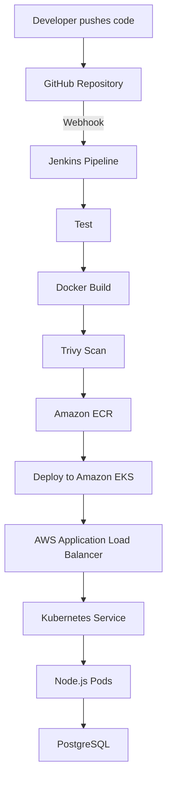

# TaskAPI — Cloud-Native CI/CD on AWS EKS

[](https://nodejs.org/)
[](https://www.docker.com/)
[](https://aws.amazon.com/eks/)
[](https://www.terraform.io/)
[](https://www.jenkins.io/)

TaskAPI is a containerized Node.js REST API deployed to Amazon EKS through a fully automated CI/CD pipeline. A GitHub push triggers Jenkins to test the application, build and scan its Docker image, push it to Amazon ECR, deploy it to Kubernetes, and verify the rollout.

The AWS infrastructure—including the VPC, networking, ECR repository, EKS cluster, and managed node group—is provisioned using Terraform. An AWS Application Load Balancer exposes the API publicly.

## Project Highlights

- Automated CI/CD pipeline triggered by a GitHub webhook
- Multi-stage Docker build running as a non-root user
- Trivy vulnerability scanning during the pipeline
- Docker images stored and versioned in Amazon ECR
- Highly available application deployment across two EKS worker nodes
- PostgreSQL database with Kubernetes persistent storage
- Health, readiness, and Prometheus-compatible metrics endpoints
- Public Layer 7 routing through AWS Load Balancer Controller
- Reproducible AWS infrastructure managed with Terraform

## Architecture



### Request Flow

```text
Client → AWS ALB → Kubernetes Ingress → ClusterIP Service → Node.js Pods → PostgreSQL
```

## Technology Stack

| Area | Technologies |
|---|---|
| Application | Node.js, Express.js, PostgreSQL |
| Containerization | Docker, Docker Compose |
| CI/CD | Jenkins, GitHub Webhooks |
| Security | Trivy, non-root containers, Kubernetes Secrets |
| Cloud | AWS EKS, ECR, EC2, VPC, ALB |
| Infrastructure as Code | Terraform |
| Orchestration | Kubernetes, AWS Load Balancer Controller |
| Package and deployment tools | npm, Helm, kubectl |

## CI/CD Pipeline

Every push to the configured GitHub branch starts the following workflow:

1. **Checkout** – Jenkins retrieves the latest source code.
2. **Test** – Application tests run before an image is created.
3. **Build** – Docker creates a versioned application image.
4. **Scan** – Trivy reports `HIGH` and `CRITICAL` vulnerabilities.
5. **Authenticate** – Jenkins logs in to Amazon ECR.
6. **Push** – The image is uploaded with a build-specific tag.
7. **Deploy** – The EKS Deployment is updated to use the new image.
8. **Verify** – Jenkins waits for the Kubernetes rollout to complete successfully.

> [!NOTE]
> Trivy currently runs as a non-blocking security check (`--exit-code 0`). Vulnerabilities remain visible in the Jenkins logs without failing the pipeline. It can be changed to `--exit-code 1` when the project is ready to enforce the security gate.

## Repository Structure

```text
.
├── src/                    # Node.js application source
├── public/                 # Static assets
├── k8s/                    # Kubernetes manifests
├── terraform/              # AWS infrastructure as code
│   ├── backend.tf
│   ├── providers.tf
│   ├── versions.tf
│   ├── variables.tf
│   ├── network.tf
│   ├── ecr.tf
│   ├── eks.tf
│   ├── iam.tf
│   └── outputs.tf
├── Dockerfile
├── docker-compose.yml
├── Jenkinsfile
├── package.json
└── README.md
```

> The exact filenames may differ slightly as the project evolves.

## API Endpoints

| Method | Endpoint | Purpose |
|---|---|---|
| `GET` | `/health` | Confirms that the Node.js process is healthy |
| `GET` | `/ready` | Confirms that the application is ready to receive traffic |
| `GET` | `/metrics` | Exposes Prometheus-compatible application metrics |
| `GET` | `/api/tasks` | Returns all tasks |
| `POST` | `/api/tasks` | Creates a task |
| `GET` | `/api/tasks/:id` | Returns a task by ID |
| `PUT/PATCH` | `/api/tasks/:id` | Updates a task |
| `DELETE` | `/api/tasks/:id` | Deletes a task |

## Run Locally

### Prerequisites

- Node.js 18 or later
- npm
- Docker and Docker Compose

### Using Docker Compose

Clone the repository:

```bash
git clone https://github.com/Rehap1/NodeJS-DevOps.git
cd NodeJS-DevOps
```

Build and start the API and PostgreSQL:

```bash
docker compose up -d --build
```

Verify the services:

```bash
docker compose ps
curl http://localhost:3000/health
curl http://localhost:3000/ready
curl http://localhost:3000/api/tasks
```

Stop the local environment:

```bash
docker compose down
```

Use `docker compose down -v` only when you also want to remove the local database volume.

## Provision AWS Infrastructure

### Prerequisites

- AWS CLI configured with suitable permissions
- Terraform
- kubectl
- Helm
- Docker

Initialize and review the Terraform configuration:

```bash
terraform -chdir=terraform init
terraform -chdir=terraform fmt -check
terraform -chdir=terraform validate
terraform -chdir=terraform plan
```

Provision the infrastructure:

```bash
terraform -chdir=terraform apply
```

Configure kubectl:

```bash
aws eks update-kubeconfig \
  --name taskapi-dev-eks \
  --region us-east-1
```

Verify the worker nodes:

```bash
kubectl get nodes
```

## Kubernetes Deployment

The application runs in the `nodejs-app` namespace with:

- Two Node.js application replicas
- A `ClusterIP` service on port `3000`
- A PostgreSQL workload and service on port `5432`
- A Kubernetes Secret for the database password
- Persistent storage for PostgreSQL
- An ALB Ingress for public HTTP access

Apply the manifests:

```bash
kubectl apply -f k8s/
```

Check the deployment:

```bash
kubectl get pods,svc,ingress -n nodejs-app
kubectl rollout status deployment/nodejs-app-deploy -n nodejs-app
```

Test without public exposure:

```bash
kubectl port-forward service/nodejs-app-service 3000:3000 -n nodejs-app
```

Then open another terminal:

```bash
curl http://localhost:3000/health
curl http://localhost:3000/ready
curl http://localhost:3000/api/tasks
```

## Public Access Through AWS ALB

The AWS Load Balancer Controller watches the Kubernetes Ingress and provisions an internet-facing Application Load Balancer.

Retrieve its hostname:

```bash
kubectl get ingress nodejs-app-ingress \
  -n nodejs-app \
  -o jsonpath='{.status.loadBalancer.ingress[0].hostname}'
```

Test the public API:

```bash
curl http://<ALB_HOSTNAME>/health
curl http://<ALB_HOSTNAME>/ready
curl http://<ALB_HOSTNAME>/api/tasks
```

## Jenkins Configuration

Jenkins requires credentials or permissions for:

- Reading the GitHub repository
- Building Docker images
- Authenticating with Amazon ECR
- Updating the Amazon EKS deployment

The GitHub webhook endpoint follows this format:

```text
http://<JENKINS_HOST>:8080/github-webhook/
```

In the Jenkins job, enable:

```text
GitHub hook trigger for GITScm polling
```

For production, place Jenkins behind HTTPS instead of exposing port `8080` directly to the internet.

## Security Practices

- The application container runs as the non-root `node` user.
- A multi-stage Docker build keeps the runtime image smaller.
- Database credentials are loaded from a Kubernetes Secret.
- ECR lifecycle rules remove old and untagged images.
- Trivy scans the image before deployment.
- Application pods are exposed through a Kubernetes Service and ALB rather than directly.
- Terraform state should be stored remotely with encryption and state locking.

Do not commit `.env` files, passwords, AWS credentials, kubeconfig files, or Terraform state to Git.

## Verification Commands

```bash
# Display the deployed image
kubectl get deployment nodejs-app-deploy \
  -n nodejs-app \
  -o jsonpath='{.spec.template.spec.containers[0].image}'

# Check the rollout
kubectl rollout status deployment/nodejs-app-deploy -n nodejs-app

# Inspect application logs
kubectl logs -l app=nodejs-app -n nodejs-app --tail=100

# Check the Ingress
kubectl describe ingress nodejs-app-ingress -n nodejs-app
```

On PowerShell, either place commands on one line or use the backtick (`` ` ``) for line continuation instead of `\`.

## Destroy the AWS Environment

Delete Kubernetes resources that provision AWS load balancers before destroying the EKS cluster:

```bash
kubectl delete ingress nodejs-app-ingress -n nodejs-app
kubectl delete namespace nodejs-app
```

Wait for the ALB to be removed, then preview and destroy the Terraform-managed infrastructure:

```bash
terraform -chdir=terraform plan -destroy
terraform -chdir=terraform destroy
```

Terraform only destroys resources recorded in its state. Manually created resources—such as the Jenkins EC2 instance or the Terraform backend—must be reviewed and removed separately if they are no longer required.

## Future Improvements

- Install Prometheus and Grafana for cluster and application monitoring
- Add dashboards for request rate, error rate, latency, CPU, and memory
- Make the Trivy vulnerability scan a blocking security gate
- Add HTTPS using ACM and an ALB certificate
- Manage application secrets with AWS Secrets Manager and External Secrets Operator
- Add automated integration and load tests
- Configure autoscaling and disruption budgets
- Add Slack or email notifications for Jenkins build results

